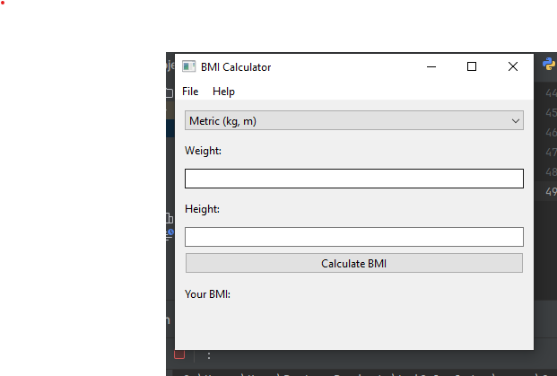
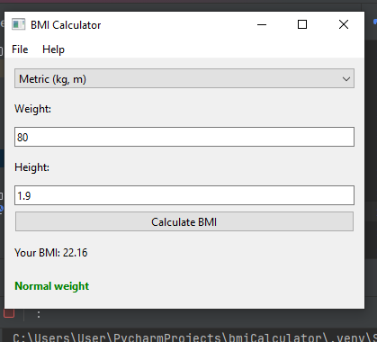
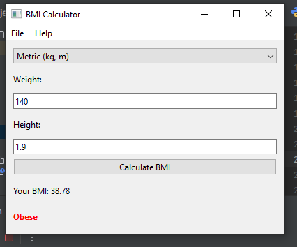

# BMI Calculator (PyQt6)

## 📌 Description
This is a simple **BMI Calculator** built with **PyQt6** using the **MVC design pattern**.

## 📌 Features
✅ **Metric & Imperial unit support**  
✅ **Color-coded BMI status display**  
✅ **Menu bar with File & Help options**  
✅ **"Clear" button to reset fields**  

## 📌 Installation & Usage
1. **Install PyQt6** (if not already installed):
   ```bash
   pip install PyQt6
2. Run the application: python main.py
📌 Screenshots
Example:

Weight: 80 kg, Height: 1.9 m → BMI: 22.2 (Normal Weight)




📌 BMI Categories:
Underweight: BMI < 18.5
Normal weight: BMI 18.5 - 25
Overweight: BMI 25 - 30
Obese: BMI > 30

---
